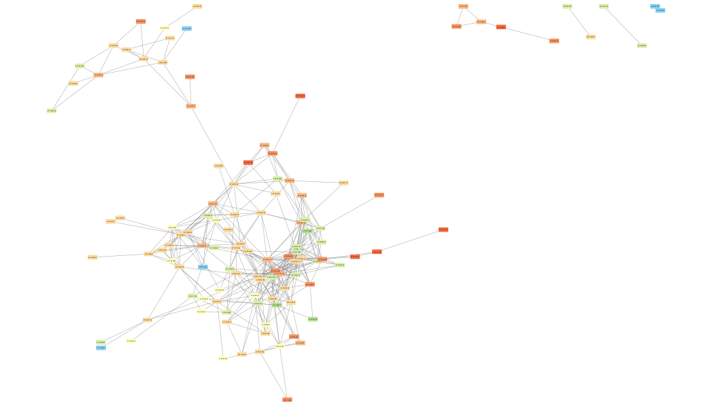
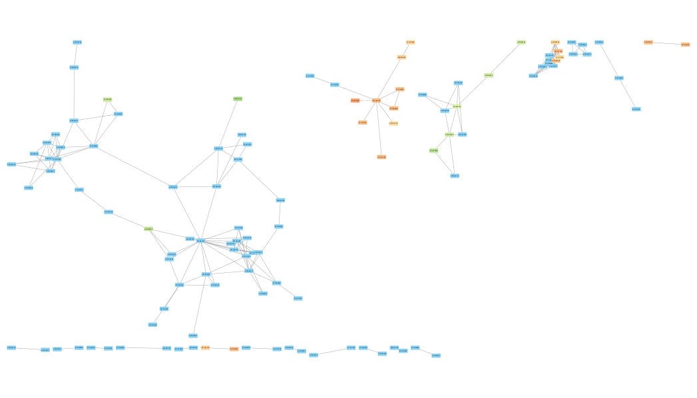
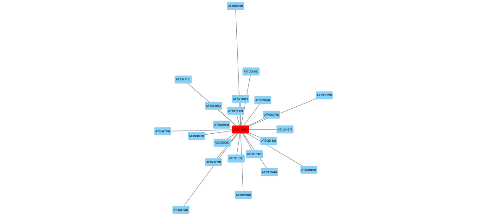

## Multi-Array Correl. Computation Utility
This respository is currently for describing the `OneStopWrapper.pl` of [maccu](https://maccu.sourceforge.net/index.html), which performs co-expression clustering in one command. In this document, we also present the use of a co-expression database of Arabidopsis Col-0 RNAseq samples made based on data from [DEE2](https://dee2.io/).

### Installation requirement
It should be feasible to run `OneStopWrapper.pl` in recent linux distributions. The only requirement is java runtime environment greater than or equal to 8. In this document, we use an ubuntu20 VM with 8GB ram to run all commands.

Install java runtime environment.
```
ubuntu@maccu:~$ sudo apt update
ubuntu@maccu:~$ sudo apt install openjdk-11-jre-headless
```

Downlaod the wrapper package and extract it. Must be sure to keep extracted files been placed under the same directory.
```
ubuntu@maccu:~$ wget https://downloads.sourceforge.net/project/maccu/0.8/maccuWrapper.tar.gz
ubuntu@maccu:~$ tar -zxvf maccuWrapper.tar.gz
```

### Download the co-expression database
Here we provide the co-expression database made based on data from the [DEE2](https://dee2.io/). Please note that this database and the DEE2 database are both under [GPLv3 public license](https://www.gnu.org/licenses/gpl-3.0.en.html) and allow academic and commercial use. We thank DEE2 and ask you to consider supporting DEE2 if your organization uses DEE2 data for financial benefit.

Download the co-expression database and extract it.
```
ubuntu@maccu:~$ wget https://maccu.project.sinica.edu.tw/maccu/coexDB/coexDB20230714.tar.gz
ubuntu@maccu:~$ tar -zxvf coexDB20230714.tar.gz
coexDB20230714/
coexDB20230714/ath/
coexDB20230714/ath/Col0/
coexDB20230714/ath/Col0/README.txt
coexDB20230714/ath/Col0/sel20210116.col0.TMM.ALL
coexDB20230714/ath/Col0/sel20210116.col0.TMM.flower
coexDB20230714/ath/Col0/sel20210116.col0.TMM.leaf
coexDB20230714/ath/Col0/sel20210116.col0.TMM.root
coexDB20230714/ath/Col0/sel20210116.col0.TMM.rosette
coexDB20230714/ath/Col0/sel20210116.col0.TMM.seed
coexDB20230714/ath/Col0/sel20210116.col0.TMM.seedling
coexDB20230714/ath/Col0/sel20210116.col0.TMM.shoot
coexDB20230714/ath/Col0/sel20210116.col0.TMM.whole
```

The files named `sel20210116.col0.TMM.*` are our database files in tab-delimited text format. They are all read count matrix normalized by the TMM method (PMID: 20196867). Their columns are samples and rows are genes. The one suffixed by `ALL` are composed of 5556 Arabidopsis Col-0 RNAseq samples, which were selected from the DEE2 database following a series of considerations. All other database files are extracted portions of this `ALL` file, where the extracted portions were decided by parsing metadata download from NCBI. For example, the `root` one is composed of root samples. For another example, the `whole` one is composed of samples using _whole plants_.

#### Database collection

We are making efforts on collecting read counts, postprocessing, and building database tables. We are now working on a few model species. Available updates of database files can be found at this [link](https://myspace.sinica.edu.tw/public.php?service=files&t=jDXOZs51J0OP81ccJX86JeFpEXUvOlUGXJZZIr2c_VRVdwh7wQSLG7qEPFa5HBhK) (cloud storage page of Academia Sinica).

| name | species | folder | .tar.gz (prefix) | comment |
| -------- | ------- | ------- | ------- | ------- |
| arabidopsis | Arabidopsis thaliana | ath | coexDB_202406.ath.ALL.tar.gz.* | 19746 QC pass RNAseq samples, tissues not classified |
| arabidopsis | Arabidopsis thaliana | ath | coexDB_202406.ath.Col0.tar.gz.* | 9089 QC pass Col-0 RNAseq samples, tissues classified |
| worm | Caenorhabditis elegans | ce | - | in progress |
| fly | Drosophila melanogaster | dm | - | in progress |
| zebrafish | Danio rerio | dm | - | in progress |
| bacteria | Escherichia coli | ec | - | in progress |
| yeast | Saccharomyces cerevisiae | sc | - | in progress |

*NOTE*: Due to file size limitation, files larger than 2GB were split into smaller files of the same prefix. All file splits are needed to extracted the database file. A (rather) convenient way to download specific files is to copy the file links from the cloud storage page and use `curl` as in the following example:

```
wdlin@comp06:somewhere$ curl -o coexDB_202406.ath.ALL.tar.gz.aa "https://myspace.sinica.edu.tw/public.php?service=files&t=jDXOZs51J0OP81ccJX86JeFpEXUvOlUGXJZZIr2c_VRVdwh7wQSLG7qEPFa5HBhK&path=%2Fath&files=coexDB_202406.ath.ALL.tar.gz.aa&download"
  % Total    % Received % Xferd  Average Speed   Time    Time     Time  Current
                                 Dload  Upload   Total   Spent    Left  Speed
100 1900M  100 1900M    0     0  93.7M      0  0:00:20  0:00:20 --:--:--  103M

wdlin@comp06:somewhere$ curl -o coexDB_202406.ath.ALL.tar.gz.ab "https://myspace.sinica.edu.tw/public.php?service=files&t=jDXOZs51J0OP81ccJX86JeFpEXUvOlUGXJZZIr2c_VRVdwh7wQSLG7qEPFa5HBhK&path=%2Fath&files=coexDB_202406.ath.ALL.tar.gz.ab&download"
  % Total    % Received % Xferd  Average Speed   Time    Time     Time  Current
                                 Dload  Upload   Total   Spent    Left  Speed
100 1900M  100 1900M    0     0  98.0M      0  0:00:19  0:00:19 --:--:--  103M

wdlin@comp06:somewhere$ curl -o coexDB_202406.ath.ALL.tar.gz.ac "https://myspace.sinica.edu.tw/public.php?service=files&t=jDXOZs51J0OP81ccJX86JeFpEXUvOlUGXJZZIr2c_VRVdwh7wQSLG7qEPFa5HBhK&path=%2Fath&files=coexDB_202406.ath.ALL.tar.gz.ac&download"
  % Total    % Received % Xferd  Average Speed   Time    Time     Time  Current
                                 Dload  Upload   Total   Spent    Left  Speed
100 1165M  100 1165M    0     0   100M      0  0:00:11  0:00:11 --:--:--  104M

wdlin@comp06:somewhere$ cat coexDB_202406.ath.ALL.tar.gz.* | tar xzvf -
coexDB_202406/ath/README.txt
coexDB_202406/ath/sel20240529.TMM
```

### First execution of `OneStopWrapper.pl`
It is OK to execute the script by specifying a full path or a relative path, and it is also OK to put its path into the PATH environment variable. Simple description of options will be displayed if no options entered.
```
ubuntu@maccu:~$ maccuWrapper/OneStopWrapper.pl
Usage: OneStopWrapper.pl [<options>]+
 options:
   [-input <name> <fileName>]+ : input gene set names and gene set files, at least one.
   -inputParam <parameterStr>  : fishing/clustering option (default: -L true)
   -maccu <JARpath>            : path to maccu.jar (default: /home/ubuntu/maccuWrapper/maccu.jar)
   -method <classStr>          : maccu.CoExpressFishing or maccu.RelationComputer(default)
   [-dbase <DBname> <DBloc>]+  : coex database names and database files
   -probeMap <fileName>        : probe-gene mapping file, in case of using array database (default: /dev/null)
   -thresh <from> <to> <step>  : correlation threshold range and step (default: 0.70 0.95 0.05)
   -outDir <dirName>           : output folder name in the final tar.gz file (default: coex)
   -graphAdj <optionStr>       : post computation adjustment parameters (default: "")
   [-fold <name> <foldChangeFileName>]+ : fold-change set name and files (default: no setting)
   [-graphAdjStr <inputPrefix> -remove <operandPrefix> <outputPrefix>]+ : graph-level remove operation on graphs
                               made base on different coex databases
   -graphAdjShift <shift>      : graph-level operand shift on computed network arrays (default: 1)
   -keep                       : keep working directory (default: no keep)
   -outputTGZ <outputFilename> : output .tgz filename (default: coexRes.tgz)
```

### Download example data files and run the first example
This github repository contains example files under the `example` directory.
```
ubuntu@maccu:~$ git clone https://github.com/wdlingit/maccu.git

ubuntu@maccu:~$ cd maccu/example/deg/
ubuntu@maccu:~/maccu/example/deg$ ls
foldchange.txt  genelist.txt
```

The `deg` directory contains two files, they are from experiment data of PMID: 20181752. The `genelist.txt` file contains simply gene IDs in AGI accessions. The `foldchange.txt` file is in tab-delimited format, where the first column is for gene IDs and the second column is for fold-chagne values. It is strongly suggested to use fold-change in log scale as the fold-change values because that could be handled easily in Cytoscape.

Since the experiment is for studying Arabidopsis roots and the initial analysis (of arrays) discovered 187 genes showed differential expression, it is of our interests to figure out potential co-expression modules inside the 187 genes. To do that, we use the database of root samples to infer potential co-expression modules.
```
ubuntu@maccu:~/maccu/example/deg$ /home/ubuntu/maccuWrapper/OneStopWrapper.pl \
                                  -input DEG genelist.txt \
                                  -dbase root /home/ubuntu/coexDB20230714/ath/Col0/sel20210116.col0.TMM.root \
                                  -fold foldchange foldchange.txt
```
Points to be noticed:
1. `-input` is used to set the input gene list file `genelist.txt` and its alias `DEG`.
2. `-dbase` is uesed to set the database file to for co-expression clustering, as well as its alias in this computation. Note that the database files must be assigned with absolute paths.
3. `-fold` is used to associate specified fold-change values to attribute `foldchange` of nodes in the final XGMML files. XGMML files can be imported into Cytoscape and it should be easy to fill node color according to node attributes. `-fold` is actually optional; that is, this can be omitted.

The execution should be finished with the following lines in the screen.
```
coex/root.DEG.0.70-all.graph
coex/root.DEG.0.75-all.graph
coex/root.DEG.0.80-all.graph
coex/root.DEG.0.85-all.graph
coex/root.DEG.0.90-all.graph
coex/root.DEG.0.95-all.graph
coex/root.DEG.0.70.xgmml
coex/root.DEG.0.75.xgmml
coex/root.DEG.0.80.xgmml
coex/root.DEG.0.85.xgmml
coex/root.DEG.0.90.xgmml
coex/root.DEG.0.95.xgmml
```
These are files to be stored in the final tar.gz file.
```
ubuntu@maccu:~/maccu/example/deg$ ls
coexRes.tgz  foldchange.txt  genelist.txt

ubuntu@maccu:~/maccu/example/deg$ tar -zxvf coexRes.tgz
coex/root.DEG.0.70-all.graph
coex/root.DEG.0.75-all.graph
coex/root.DEG.0.80-all.graph
coex/root.DEG.0.85-all.graph
coex/root.DEG.0.90-all.graph
coex/root.DEG.0.95-all.graph
coex/root.DEG.0.70.xgmml
coex/root.DEG.0.75.xgmml
coex/root.DEG.0.80.xgmml
coex/root.DEG.0.85.xgmml
coex/root.DEG.0.90.xgmml
coex/root.DEG.0.95.xgmml
```

There are two kinds of files been outputted:
1. `.graph`: tab-delimited text files, representing graphs in [adjacency list](https://en.wikipedia.org/wiki/Adjacency_list) format. Each line represents one node (the first token) and edges connecting to it (other token, where numbers in parentheses are correlations).
2. `.xgmml`: [XGMML](https://en.wikipedia.org/wiki/XGMML) files. These files can be imported into Cytoscape use its `File->Import->Network from File` function. In so doing, correlations between edges would be saved as `weight` attributes of edges in Cytoscape.

Note that the files were named in the format `<database>.<gene set>.<threshold>`, where each file represents edges been recognized by using `<database>` between genes in `<gene set>` that are above `<threshold>` (in terms of correlation). In this naming scheme, we can apply options `-input` and `-dbase` multiple times with different aliases and perform all combinations of computations in one execution. By the way, the default threshold series is 0.95, 0.90, 0.85, ... 0.70 and this can be adjusted by applying the `-thresh` option.

The following picture was made by importing root.DEG.0.70.xgmml into Cytoscape and setting continuous mapping on node filling colors with attribute `foldchange`.



### Run the second example
The `timecourse` directory contains four files, `797genes.txt` for the gene list and the three files for log2-fold-changes in different time points. They are from the time course experiment of PMID: 21248074.
```
ubuntu@maccu:~/maccu/example/deg$ cd ../timecourse/

ubuntu@maccu:~/maccu/example/timecourse$ ls
797genes.txt  t01.txt  t06.txt  t24.txt
```

From the last example, we learned that options `-input`, `-dbase`, and `-fold` can be applied multiple times.
```
ubuntu@maccu:~/maccu/example/timecourse$ /home/ubuntu/maccuWrapper/OneStopWrapper.pl \
                                         -input DEG 797genes.txt \
                                         -dbase root /home/ubuntu/coexDB20230714/ath/Col0/sel20210116.col0.TMM.root \
                                         -dbase ALL /home/ubuntu/coexDB20230714/ath/Col0/sel20210116.col0.TMM.ALL \
                                         -fold t01 t01.txt \
                                         -fold t06 t06.txt \
                                         -fold t24 t24.txt
(deleted outputs...)
coex/ALL.DEG.0.70-all.graph
coex/ALL.DEG.0.75-all.graph
coex/ALL.DEG.0.80-all.graph
coex/ALL.DEG.0.85-all.graph
coex/ALL.DEG.0.90-all.graph
coex/ALL.DEG.0.95-all.graph
coex/root.DEG.0.70-all.graph
coex/root.DEG.0.75-all.graph
coex/root.DEG.0.80-all.graph
coex/root.DEG.0.85-all.graph
coex/root.DEG.0.90-all.graph
coex/root.DEG.0.95-all.graph
coex/ALL.DEG.0.70.xgmml
coex/ALL.DEG.0.75.xgmml
coex/ALL.DEG.0.80.xgmml
coex/ALL.DEG.0.85.xgmml
coex/ALL.DEG.0.90.xgmml
coex/ALL.DEG.0.95.xgmml
coex/root.DEG.0.70.xgmml
coex/root.DEG.0.75.xgmml
coex/root.DEG.0.80.xgmml
coex/root.DEG.0.85.xgmml
coex/root.DEG.0.90.xgmml
coex/root.DEG.0.95.xgmml
```
In so doing, we will have networks computed based on root database and ALL database, respectively. Also, the application of `-fold` would set three node attributes `t01`, `t06`, and `t24` in the XGMML files.

Compute different combinations of `<database>.<gene set>` would enable us to perform meaningful graph-level operations. For this example, we just computed `root.DEG` and `ALL.DEG`, doing `root.DEG - ALL.DEG` should give use gene pairs that show high enough correlations in root samples but not that high in ALL samples. More specifically, operation `root.DEG.0.8 - ALL.DEG.0.7` should give us gene pairs with correlations 0.8 or above in root samples an also with correlation lower than 0.7 in ALL samples => gene paris with correlations in roots significantly higher than that in ALL samples => gene pairs with root-specific correlations.

```
ubuntu@maccu:~/maccu/example/timecourse$ /home/ubuntu/maccuWrapper/OneStopWrapper.pl \
                                         -input DEG 797genes.txt \
                                         -dbase root /home/ubuntu/coexDB20230714/ath/Col0/sel20210116.col0.TMM.root \
                                         -dbase ALL /home/ubuntu/coexDB20230714/ath/Col0/sel20210116.col0.TMM.ALL \
                                         -fold t01 t01.txt \
                                         -fold t06 t06.txt \
                                         -fold t24 t24.txt \
                                         -graphAdjStr root.DEG -remove ALL.DEG specific \
                                         -graphAdjShift 2 \
                                         -thresh 0.8 0.95 0.05
(deleted outputs...)
coex/ALL.DEG.0.80-all.graph
coex/ALL.DEG.0.85-all.graph
coex/ALL.DEG.0.90-all.graph
coex/ALL.DEG.0.95-all.graph
coex/root.DEG.0.80-all.graph
coex/root.DEG.0.85-all.graph
coex/root.DEG.0.90-all.graph
coex/root.DEG.0.95-all.graph
coex/specific.0.90-all.graph
coex/specific.0.95-all.graph
coex/ALL.DEG.0.80.xgmml
coex/ALL.DEG.0.85.xgmml
coex/ALL.DEG.0.90.xgmml
coex/ALL.DEG.0.95.xgmml
coex/root.DEG.0.80.xgmml
coex/root.DEG.0.85.xgmml
coex/root.DEG.0.90.xgmml
coex/root.DEG.0.95.xgmml
coex/specific.0.90.xgmml
coex/specific.0.95.xgmml
```

The two options `-graphAdjStr` and `-graphAdjShift` are related with the above described graph-level operation. `-graphAdjStr` is used for specifying operand networks in the computation, in terms of `<db1>.<set1>` ve `<db2>.<set2>`. The `<threshold>` part of generated networks is the series of 0.95, 0.90, 0.85, and 0.80 (assigned by `-thresh`). `-graphAdjShift` is used for dealiing with the `<threshold>` part in the graph-level computation. It specifies the _threshold shift_ between `<db1>.<set1>` ve `<db2>.<set2>`. In this example, we would like to compute `root.DEG.0.95 - ALL.DEG.0.85` and `root.DEG.0.9 - ALL.DEG.0.8` as the _threshold step_ is 0.05 (specified by `-thresh`). The threshold difference between network operands is 0.1, which is twice of the _threshold step_, so we set `-graphAdjShift 2`. As a result, there will be a number of .graph files and XGMML files prefixed by "specific" (specified by `-graphAdjStr`) made by the graph-level operation.

The followig picture was made by importing root.DEG.0.90.xgmml to Cytoscape, where the coloring was based on `t01`.


The following picture was made by importing specific.0.90.xgmml to Cytoscape, which was computed by `root.DEG.0.90 - ALL.DEG.0.80`. The three subpictures were colored based on `t01`, `t06`, and `t24` (from left to right), respectively.


### Run the fishing example
By default, `-method` is set as `maccu.RelationComputer`, which was used for computing relationships between input genes. To discover relatioinships between input genes and all other genes, we will have to set `-method` to `maccu.CoExpressFishing`. In this example, we go to the `fishing` directory and use the `bait.txt` file as the input.
```
ubuntu@maccu:~/maccu/example/timecourse$ cd ../fishing/

ubuntu@maccu:~/maccu/example/fishing$ ls
bait.txt

ubuntu@maccu:~/maccu/example/fishing$ cat bait.txt
AT5G13630       1
```
The `bait.txt` file contains exactly one gene ID and is in tab-delimited format. Note that this tab-delimited format is not a requrirement. The gene list reading function reads exactly the first token of every line. Doing so is to let the `-fold` option can use the same file so that we can have some node attribute been set to 1 only for the initial bait genes.

```
ubuntu@maccu:~/maccu/example/fishing$ /home/ubuntu/maccuWrapper/OneStopWrapper.pl \
                                      -input bait bait.txt \
                                      -method maccu.CoExpressFishing \
                                      -inputParam "-STEP 1" \
                                      -dbase root /home/ubuntu/coexDB20230714/ath/Col0/sel20210116.col0.TMM.root \
                                      -fold bait bait.txt
```
Points to be noticed:
1. `-method` was set to `maccu.CoExpressFishing` so that the fishing algorithm would be invoked,
2. `-inputParam "-STEP 1"` to transfer the parameter `"-STEP 1"` to `maccu.CoExpressFishing` so that the fishing procedre would go only depth 1.
3. `-fold bait bait.txt` so that node attribute `bait` of AT5G13630 will be 1.

The followig picture was made by importing root.bait.0.80.xgmml to Cytoscape. Note that AT5G13630 was marked red via the `bait` node attribute.

